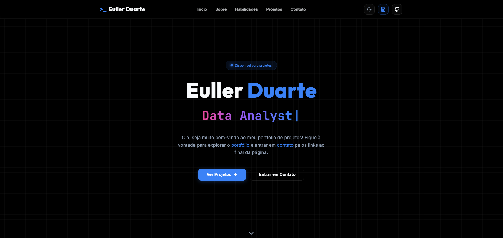

# 💼 Portfólio — Euller Duarte

<div align="center">



**Um portfólio web moderno e responsivo desenvolvido com HTML5, CSS3 (ITCSS) e JavaScript puro (ES6 Modules)**

[](.)\
[](.)\
[](.)\
[](.)

[🌐 Demo Ao Vivo](https://euuuller.vercel.app) • [📁 Estrutura](#-estrutura-do-projeto) • [🚀 Quick Start](#-quick-start) • [📖 Documentação](#-arquitetura)

</div>

---

## 📑 Índice

- [✨ Destaques](#-destaques)
- [🎯 Sobre](#-sobre)
- [🏗️ Arquitetura](#-arquitetura)
- [📁 Estrutura do Projeto](#-estrutura-do-projeto)
- [⚙️ Stack Tecnológico](#-stack-tecnológico)
- [🚀 Quick Start](#-quick-start)
- [📖 Guia de Desenvolvimento](#-guia-de-desenvolvimento)
- [💻 Seções do Site](#-seções-do-site)
- [🎨 Sistema de Temas](#-sistema-de-temas)
- [📱 Responsividade](#-responsividade)
- [♿ Acessibilidade](#-acessibilidade)
- [👤 Autor](#-autor)
- [📄 Licença](#-licença)

---

## ✨ Destaques

- 🎨 **Design ITCSS** com organização modular em 7 níveis de cascata CSS
- 🌓 **Sistema de Temas** persistente em `localStorage` (dark/light mode)
- 📱 **Totalmente Responsivo** com breakpoints otimizados (desktop, tablet, mobile)
- ⚡ **Zero Dependências de Build** — HTML/CSS/JavaScript puro (vanilla)
- 🧩 **Arquitetura Data-Driven** — conteúdo centralizado em `portfolio.js`, sem tocar no HTML
- 🖱️ **Modal de Projetos** com animação e detalhes por projeto
- 📬 **Formulário de Contato AJAX** via FormSubmit com feedback visual (toast)
- 🔄 **Carrossel Infinito de Skills** gerado dinamicamente via JSON
- 📊 **Integração GitHub API** — contagem de repositórios em tempo real
- 🎬 **Animações Fluidas** com múltiplos `@keyframes` otimizados
- ♿ **Acessível** com HTML semântico, ARIA labels e navegação por teclado
- 🔍 **Otimizado para SEO** com meta tags e estrutura de headings correta

---

## 🎯 Sobre

Portfólio profissional de **Euller Duarte**, Analista de Dados e Graduando em Engenharia Elétrica no Instituto Federal do Maranhão (IFMA). O projeto foi desenvolvido para apresentar projetos, habilidades técnicas e informações de contato de forma moderna e interativa.

Além de ser um portfólio, este projeto demonstra:
- **Desenvolvimento web** com HTML5, CSS3 e JavaScript ES6+
- **Pensamento em arquitetura** com ITCSS e módulos JavaScript
- **UX consciente** com animações, responsividade e acessibilidade
- **Dados centralizados** via arquitetura Data-Driven (sem duplicar conteúdo no HTML)

---

## 🏗️ Arquitetura

### CSS — ITCSS (Inverted Triangle CSS)

A estrutura CSS segue o padrão **ITCSS**, dividida em 7 níveis de especificidade crescente:

```
📊 ITCSS Cascade (Do Geral para o Específico)

1️⃣  VARIABLES   → variables.css         (tokens: cores, fontes, tamanhos)
2️⃣  RESET       → reset.css             (normalização do browser)
3️⃣  BASE        → typography.css        (tipografia global)
                 → animations.css        (@keyframes reutilizáveis)
4️⃣  LAYOUT      → grid.css              (container, sistema de colunas)
                 → spacing.css           (espaçamentos responsivos)
5️⃣  COMPONENTS  → button.css            (botões reutilizáveis)
                 → modal.css             (modal de projetos)
6️⃣  SECTIONS    → header / hero / about / skills / projects / contact / footer
7️⃣  UTILITIES   → (reservado para helpers futuros)
```

### JavaScript — Arquitetura Modular (ES6)

```
assets/js/
├── main.js              # Orquestrador (DOMContentLoaded)
│
├── core/
│   ├── dom.js           # Utilitários de manipulação DOM
│   ├── utils.js         # Helpers (debounce, throttle, storage)
│   └── constants.js     # CONFIG, SELECTORS, CLASSES
│
├── config/
│   └── theme-config.js  # Sistema de temas (dark/light)
│
├── data/
│   ├── portfolio.js     # ⚠️ Fonte única de verdade para textos e links
│   └── projects.js      # Dados dos projetos para o modal
│
└── modules/
    ├── binder.js        # Motor de data-binding (injeta portfolio.js no HTML)
    ├── theme.js         # Toggle dark/light com localStorage
    ├── typing.js        # Efeito de digitação na hero section
    ├── navigation.js    # Smooth scroll e navegação
    ├── skills.js        # Carrossel de skills (gerado por JSON)
    ├── modal.js         # Modal de detalhes de projetos
    ├── github.js        # Integração com API pública do GitHub
    └── contact.js       # Envio AJAX do formulário via FormSubmit
```

---

## 📁 Estrutura do Projeto

```plaintext
Template/
│
├── 📄 index.html                  # Página principal (comentada)
├── 📄 README.md                   # Este arquivo
├── 📄 LICENSE                     # MIT License
│
└── 📂 assets/
    │
    ├── 📂 css/
    │   ├── main.css               # Entry point do CSS (só @imports)
    │   ├── variables.css          # Tokens do design system
    │   ├── reset.css              # Normalização de estilos
    │   │
    │   ├── 📂 base/
    │   │   ├── typography.css
    │   │   └── animations.css
    │   │
    │   ├── 📂 layout/
    │   │   ├── grid.css
    │   │   └── spacing.css
    │   │
    │   ├── 📂 components/
    │   │   ├── button.css
    │   │   └── modal.css
    │   │
    │   ├── 📂 sections/
    │   │   ├── header.css
    │   │   ├── hero.css
    │   │   ├── about.css
    │   │   ├── skills.css
    │   │   ├── projects.css
    │   │   ├── contact.css
    │   │   └── footer.css
    │   │
    │   └── 📂 utilities/          # Reservado para classes utilitárias futuras
    │
    ├── 📂 js/
    │   ├── main.js
    │   ├── 📂 core/
    │   │   ├── dom.js
    │   │   ├── utils.js
    │   │   └── constants.js
    │   ├── 📂 config/
    │   │   └── theme-config.js
    │   ├── 📂 data/
    │   │   ├── portfolio.js       # ⚠️ Edite aqui para personalizar o portfólio
    │   │   └── projects.js        # ⚠️ Edite aqui para adicionar/remover projetos
    │   └── 📂 modules/
    │       ├── binder.js
    │       ├── contact.js
    │       ├── github.js
    │       ├── modal.js
    │       ├── navigation.js
    │       ├── skills.js
    │       ├── theme.js
    │       └── typing.js
    │
    ├── 📂 docs/
    │   └── curriculo.pdf          # Currículo para download
    │
    └── 📂 images/
        ├── favicon.svg
        └── print.png
```

---

## ⚙️ Stack Tecnológico

### Frontend
| Tecnologia | Versão | Finalidade |
|-----------|--------|-----------|
| **HTML5** | Latest | Semântica e estrutura |
| **CSS3** | Latest | Estilos e animações (ITCSS) |
| **JavaScript ES6+** | Vanilla | Módulos e interatividade |
| **Lucide Icons** | Latest | Ícones SVG modernos |
| **Remix Icon** | 3.5.0 | Ícones adicionais |

### Tipografia (Google Fonts)
- **Outfit** (Display) — Títulos
- **Inter** (Sans-serif) — Corpo
- **JetBrains Mono** (Monospace) — Destaque de código

### Serviços Externos
| Serviço | Uso |
|---------|-----|
| **FormSubmit** | Envio do formulário de contato (sem backend) |
| **GitHub API** | Contagem pública de repositórios |
| **Vercel** | Deploy e hospedagem |

---

## 🚀 Quick Start

### Pré-requisitos
- Navegador moderno (Chrome, Firefox, Safari, Edge)
- VS Code com a extensão [Live Server](https://marketplace.visualstudio.com/items?itemName=ritwickdey.LiveServer) **(recomendado)**

> ⚠️ O projeto usa **ES6 Modules** (`type="module"`). É necessário servi-lo via servidor HTTP — abrir o `index.html` diretamente pelo sistema de arquivos não funcionará.

### Instalação

```bash
# 1. Clone o repositório
git clone https://github.com/Euuuller/Template.git
cd Template
```

**Opção A: VS Code Live Server** *(recomendado)*
- Instale a extensão Live Server
- Clique em **"Go Live"** no canto inferior direito

**Opção B: Python**
```bash
python -m http.server 8000
# Acesse: http://localhost:8000
```

---

## 📖 Guia de Desenvolvimento

### Personalizando o conteúdo

Todo o conteúdo de texto, links e informações pessoais está centralizado em **um único arquivo**:

```
assets/js/data/portfolio.js
```

Edite este arquivo para atualizar nome, links de redes sociais, descrições, etc. **sem tocar no HTML.**

```javascript
// Exemplo: assets/js/data/portfolio.js
profile: {
    fullName: "Seu Nome",
    role: "Sua Profissão",
    email: "seu@email.com",
    github: "https://github.com/seu-usuario",
    linkedin: "https://linkedin.com/in/seu-usuario",
    cvLink: "assets/docs/curriculo.pdf",
}
```

### Adicionando projetos

Os projetos exibidos no **modal de detalhes** são gerenciados por:

```
assets/js/data/projects.js
```

### Adicionando novo componente CSS

1. Crie `assets/css/components/card.css`
2. Adicione em `assets/css/main.css`:
   ```css
   @import url('./components/card.css');
   ```

### Adicionando novo módulo JavaScript

1. Crie `assets/js/modules/meumodulo.js` com:
   ```javascript
   export function initMeuModulo() { ... }
   ```
2. Importe e chame em `assets/js/main.js`:
   ```javascript
   import { initMeuModulo } from './modules/meumodulo.js';
   // dentro do DOMContentLoaded:
   initMeuModulo();
   ```

---

## 💻 Seções do Site

### 1. **Header** (`header.css`)
Navegação fixa com glassmorphism, logo, menu de seções e botões de ação (tema, currículo, GitHub).

### 2. **Hero** (`hero.css`)
Seção inicial com badge de disponibilidade, título com gradient text, efeito de digitação em loop, botões CTA e scroll indicator.

### 3. **Sobre** (`about.css`)
Foto circular, descrição profissional com texto destacado e cards de estatísticas (Repositórios via API, Foco e Formação).

### 4. **Habilidades** (`skills.css`)
Dois carrosséis infinitos e automáticos com ícones das tecnologias, gerados dinamicamente via JSON.

### 5. **Projetos** (`projects.css` + `modal.css`)
Grid responsivo de cards com overlay interativo. Ao clicar em um projeto, abre um modal com detalhes completos (desafio, solução, impacto, stack, métricas).

### 6. **Contato** (`contact.css`)
Layout 2 colunas: canais de contato (Email, LinkedIn, GitHub, Medium) + formulário AJAX com feedback via toast notification.

### 7. **Footer** (`footer.css`)
Rodapé com copyright e créditos animados.

---

## 🎨 Sistema de Temas

O projeto suporta **dark mode** e **light mode**, com persistência via `localStorage`.

```css
/* variables.css */
:root {
    --bg-main: #FFFFFF;      /* Default: light */
    --text-main: #000000;
}

[data-theme="dark"] {
    --bg-main: #0F0F0F;
    --text-main: #FFFFFF;
}
```

**Fluxo de funcionamento:**
1. `theme-config.js` lê o `localStorage` ou detecta `prefers-color-scheme`
2. Aplica `data-theme` no `<html>`
3. O botão 🌙/☀️ no header faz o toggle e salva a preferência

---

## 📱 Responsividade

```css
/* Desktop: 1200px+ — Layout padrão */
/* Tablet:  até 992px */
@media (max-width: 992px) { ... }

/* Mobile:  até 768px */
@media (max-width: 768px) { ... }

/* Small:   até 480px */
@media (max-width: 480px) { ... }
```

**Técnicas utilizadas:**
- `clamp()` para tipografia fluida
- `repeat(auto-fit, minmax())` para grids adaptáveis
- Flexbox e CSS Grid

---

## ♿ Acessibilidade

- HTML semântico (`<header>`, `<nav>`, `<main>`, `<section>`, `<article>`, `<footer>`)
- `aria-label` em todos os botões e ícones
- Navegação por teclado (Tab, Enter, Escape para fechar modal)
- Atributos `alt` em imagens
- Estrutura lógica de headings (`h1` → `h2` → `h3`)
- Contraste de cores em conformidade com **WCAG 2.1**

---

## 👤 Autor

**Euller Duarte**
Analista de Dados | Graduando em Engenharia Elétrica (IFMA)

[](https://linkedin.com/in/euuuller)
[](https://github.com/Euuuller)
[](mailto:euller.santos.duarte@gmail.com)
[](https://medium.com/@euller.santos.duarte)

---

## 📄 Licença

Este projeto está licenciado sob a **MIT License** — veja o arquivo [LICENSE](LICENSE) para detalhes.

```
Copyright (c) 2026 Euller dos Santos Rodrigues Duarte
```

---

<div align="center">

**Desenvolvido com ❤️ + ☕ por Euller Duarte**

⭐ Se este projeto foi útil, considere deixar uma estrela!


</div>
